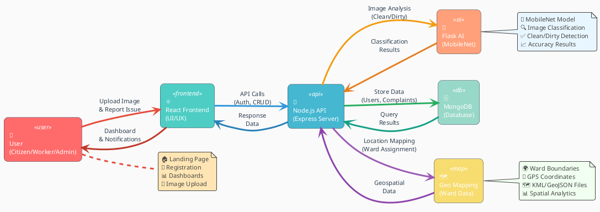

# Bin There, Done That 🚮

A full-stack garbage management and reporting system for smarter, cleaner cities.

## System Architecture



---

## Table of Contents
- [Overview](#overview)
- [Features](#features)
- [Tech Stack](#tech-stack)
- [Project Structure](#project-structure)
- [Setup](#setup)
- [Usage](#usage)
- [Contributing](#contributing)
- [License](#license)

---

## Overview
This project enables users to report garbage issues, upload images for AI-based cleanliness detection, and manage municipal operations with geospatial mapping. It includes:
- A React frontend
- A Node.js/Express backend for API and file management
- A Flask backend for AI/model inference
- Geospatial data for mapping

---

## Features
- User authentication (citizen, government employee, worker)
- Image upload & classification (clean/dirty street detection)
- Complaint reporting & tracking
- Admin and worker dashboards
- Geospatial mapping of wards and complaints
- Email notifications

---

## Tech Stack
- **Frontend:** React, Tailwind CSS
- **Backend:** Node.js (Express), Python (Flask)
- **Database:** MongoDB
- **AI/ML:** PyTorch (MobileNet)
- **Mapping:** GeoJSON, KML

---

## Project Structure
```
client/           # React frontend
flask-backend/    # Python Flask AI backend
server/           # Node.js/Express backend
Map-Operation/    # Geospatial data & scripts
```

---

## Setup
1. Clone the repo and install dependencies in each subproject:
   - `npm install` (Node.js projects)
   - `pip install -r requirements.txt` (Python)
2. Configure `.env` files as needed
3. Start Flask backend: `python app.py`
4. Start Node.js server: `npm start` or `node servers.js`
5. Start React client: `npm start` in `client/`

---

## Usage
- Register/login as a user
- Report garbage issues with images
- View and manage complaints on dashboards
- Admins and workers can update status and view geospatial data

---

## Contributing
Pull requests are welcome! For major changes, please open an issue first to discuss what you would like to change.

---

## License
MIT (or specify your license)

---

## Author
aadilnawaz shaikh
